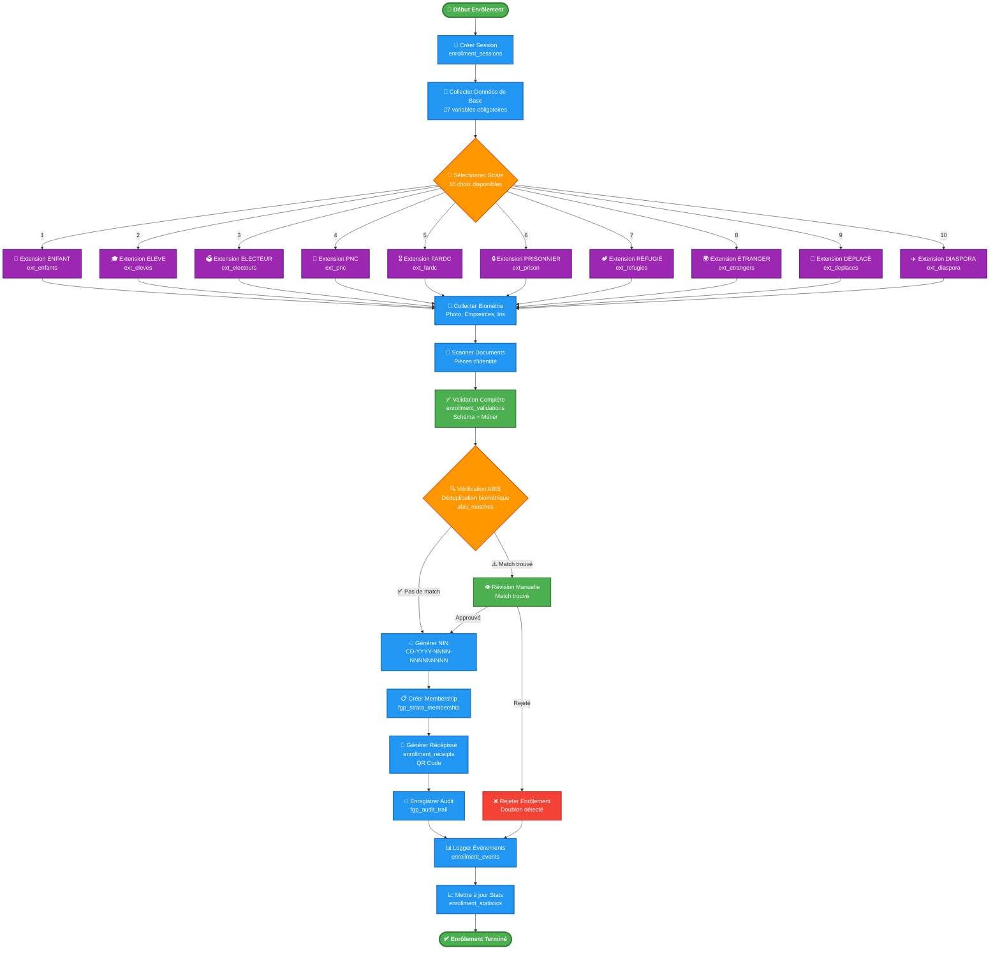
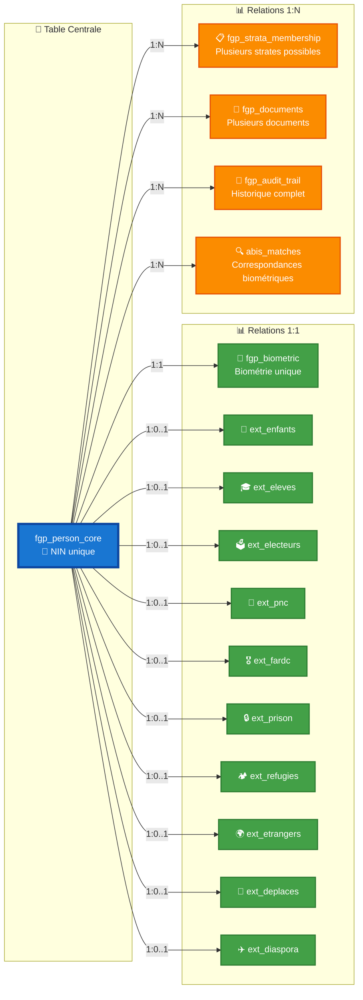
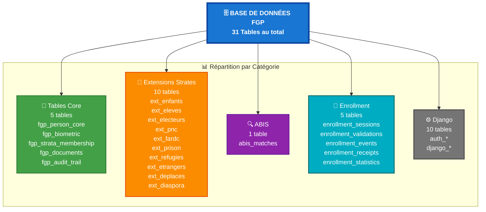

# 📊 ARCHITECTURE DE LA BASE DE DONNÉES FGP

## 🗺️ DIAGRAMME PRINCIPAL - ARCHITECTURE GLOBALE

```mermaid
graph TB
    %% ============================================
    %% NŒUD CENTRAL
    %% ============================================
    PersonCore[💾 fgp_person_core<br/>TABLE CENTRALE<br/>27 variables obligatoires]
    
    %% ============================================
    %% TABLES SYSTÈME
    %% ============================================
    subgraph "📊 Données Système"
        Biometric[🔬 fgp_biometric<br/>Biométrie<br/>Photo, Empreintes, Iris]
        Strata[📋 fgp_strata_membership<br/>Appartenance aux Strates<br/>10 strates actives]
        Documents[📄 fgp_documents<br/>Documents & Pièces jointes]
        Audit[📝 fgp_audit_trail<br/>Traçabilité complète]
        ABIS[🔍 abis_matches<br/>Déduplication biométrique]
    end
    
    %% ============================================
    %% EXTENSIONS - STRATES
    %% ============================================
    subgraph "👶 Strate 1: ENFANT"
        ExtEnfant[👶 ext_enfants<br/>Informations tuteur<br/>Autorisation parentale]
    end
    
    subgraph "🎓 Strate 2: ÉLÈVE"
        ExtEleve[🎓 ext_eleves<br/>Établissement scolaire<br/>Niveau, Cycle, Année]
    end
    
    subgraph "🗳️ Strate 3: ÉLECTEUR"
        ExtElecteur[🗳️ ext_electeurs<br/>Centre de vote CENI<br/>Bureau, Circonscription]
    end
    
    subgraph "👮 Strate 4: PNC"
        ExtPNC[👮 ext_pnc<br/>Police Nationale<br/>Matricule, Grade, Unité]
    end
    
    subgraph "🎖️ Strate 5: FARDC"
        ExtFARDC[🎖️ ext_fardc<br/>Forces Armées<br/>Matricule, Grade, Zone]
    end
    
    subgraph "🔒 Strate 6: PRISONNIER"
        ExtPrison[🔒 ext_prison<br/>Détention<br/>Dossier judiciaire]
    end
    
    subgraph "🏕️ Strate 7: RÉFUGIÉ"
        ExtRefugie[🏕️ ext_refugies<br/>Réfugiés & Apatrides<br/>Numéro HCR, Pays origine]
    end
    
    subgraph "🌍 Strate 8: ÉTRANGER"
        ExtEtranger[🌍 ext_etrangers<br/>Étrangers en RDC<br/>Passeport, Visa, Permis]
    end
    
    subgraph "🚶 Strate 9: DÉPLACÉ"
        ExtDeplace[🚶 ext_deplaces<br/>Déplacés internes<br/>Lieu origine, Camp, Assistance]
    end
    
    subgraph "✈️ Strate 10: DIASPORA"
        ExtDiaspora[✈️ ext_diaspora<br/>Diaspora congolaise<br/>Pays résidence, Consulat]
    end
    
    %% ============================================
    %% GATEWAY D'ENRÔLEMENT
    %% ============================================
    subgraph "🔄 Enrollment Gateway"
        Sessions[📋 enrollment_sessions<br/>Sessions d'enrôlement]
        Validations[✅ enrollment_validations<br/>Validations règles métier]
        Events[📊 enrollment_events<br/>Événements & Logs]
        Receipts[🎫 enrollment_receipts<br/>Récépissés générés]
        Stats[📈 enrollment_statistics<br/>Statistiques monitoring]
    end
    
    %% ============================================
    %% RELATIONS PRINCIPALES
    %% ============================================
    PersonCore --> Biometric
    PersonCore --> Strata
    PersonCore --> Documents
    PersonCore --> Audit
    PersonCore --> ABIS
    
    PersonCore --> ExtEnfant
    PersonCore --> ExtEleve
    PersonCore --> ExtElecteur
    PersonCore --> ExtPNC
    PersonCore --> ExtFARDC
    PersonCore --> ExtPrison
    PersonCore --> ExtRefugie
    PersonCore --> ExtEtranger
    PersonCore --> ExtDeplace
    PersonCore --> ExtDiaspora
    
    Sessions --> Validations
    Sessions --> Events
    Sessions --> Receipts
    
    %% ============================================
    %% STYLES
    %% ============================================
    classDef central fill:#1976D2,stroke:#0D47A1,stroke-width:4px,color:#fff,font-weight:bold
    classDef system fill:#43A047,stroke:#2E7D32,stroke-width:2px,color:#fff
    classDef extension fill:#FB8C00,stroke:#E65100,stroke-width:2px,color:#fff
    classDef enrollment fill:#8E24AA,stroke:#6A1B9A,stroke-width:2px,color:#fff
    
    class PersonCore central
    class Biometric,Strata,Documents,Audit,ABIS system
    class ExtEnfant,ExtEleve,ExtElecteur,ExtPNC,ExtFARDC,ExtPrison,ExtRefugie,ExtEtranger,ExtDeplace,ExtDiaspora extension
    class Sessions,Validations,Events,Receipts,Stats enrollment
```

---

## 🔄 FLUX D'ENRÔLEMENT COMPLET

---

## 🔗 RELATIONS ET CARDINALITÉS

---

## 📈 STATISTIQUES DE LA BASE

---

## 🎯 LES 10 STRATES

```mermaid
graph TB
    Strates[🎯 10 STRATES OFFICIELLES]
    
    S1[👶 ENFANT<br/>Enfants mineurs<br/>Tuteur requis]
    S2[🎓 ELEVE<br/>Élèves primaire/secondaire<br/>Établissement requis]
    S3[🗳️ ELECTEUR<br/>Électeurs/Majeurs<br/>Centre de vote CENI]
    S4[👮 PNC<br/>Police Nationale<br/>Matricule + Grade]
    S5[🎖️ FARDC<br/>Forces Armées<br/>Matricule + Grade]
    S6[🔒 PRISONNIER<br/>Détenus<br/>Dossier judiciaire]
    S7[🏕️ REFUGIE<br/>Réfugiés & Apatrides<br/>Numéro HCR]
    S8[🌍 ETRANGER<br/>Étrangers en RDC<br/>Passeport + Visa]
    S9[🚶 DEPLACE<br/>Déplacés internes<br/>Lieu origine + Camp]
    S10[✈️ DIASPORA<br/>Diaspora congolaise<br/>Pays résidence]
    
    Strates --> S1
    Strates --> S2
    Strates --> S3
    Strates --> S4
    Strates --> S5
    Strates --> S6
    Strates --> S7
    Strates --> S8
    Strates --> S9
    Strates --> S10
    
    classDef title fill:#1976D2,stroke:#0D47A1,stroke-width:4px,color:#fff,font-weight:bold
    classDef strate fill:#FB8C00,stroke:#E65100,stroke-width:2px,color:#fff
    
    class Strates title
    class S1,S2,S3,S4,S5,S6,S7,S8,S9,S10 strate
```

---

## 🔐 SÉCURITÉ ET CONTRAINTES

```mermaid
graph TB
    Security[🔐 SÉCURITÉ & CONTRAINTES]
    
    subgraph "✅ Contraintes CHECK"
        C1[NIN Format<br/>CD-YYYY-NNNN-NNNNNNNNN]
        C2[Sexe<br/>M ou F uniquement]
        C3[10 Strates<br/>Codes validés]
        C4[Statut Membership<br/>ACTIVE/INACTIVE/SUSPENDED]
        C5[Décision ABIS<br/>HIT/NO_HIT/REVIEW]
    end
    
    subgraph "🔑 Clés Primaires"
        PK1[NIN unique<br/>20 caractères]
        PK2[UUID v4<br/>Tables système]
        PK3[Composite Keys<br/>fgp_strata_membership]
    end
    
    subgraph "🔗 Clés Étrangères"
        FK1[Toutes extensions → NIN]
        FK2[Documents → NIN]
        FK3[Audit → NIN]
        FK4[ABIS → 2x NIN]
        FK5[Validations → Session]
    end
    
    subgraph "📑 Index Performance"
        IDX1[nom, prenom<br/>Recherche rapide]
        IDX2[date_naissance<br/>Recherche par âge]
        IDX3[telephone<br/>Contact unique]
        IDX4[strate_code<br/>Filtrage strate]
        IDX5[created_at<br/>Tri temporel]
    end
    
    Security --> C1
    Security --> C2
    Security --> C3
    Security --> C4
    Security --> C5
    Security --> PK1
    Security --> PK2
    Security --> PK3
    Security --> FK1
    Security --> FK2
    Security --> FK3
    Security --> FK4
    Security --> FK5
    Security --> IDX1
    Security --> IDX2
    Security --> IDX3
    Security --> IDX4
    Security --> IDX5
    
    classDef title fill:#1976D2,stroke:#0D47A1,stroke-width:4px,color:#fff,font-weight:bold
    classDef check fill:#43A047,stroke:#2E7D32,stroke-width:2px,color:#fff
    classDef pk fill:#FB8C00,stroke:#E65100,stroke-width:2px,color:#fff
    classDef fk fill:#8E24AA,stroke:#6A1B9A,stroke-width:2px,color:#fff
    classDef idx fill:#00ACC1,stroke:#006064,stroke-width:2px,color:#fff
    
    class Security title
    class C1,C2,C3,C4,C5 check
    class PK1,PK2,PK3 pk
    class FK1,FK2,FK3,FK4,FK5 fk
    class IDX1,IDX2,IDX3,IDX4,IDX5 idx
```

---

**Légende des couleurs** :
- 🔵 **Bleu** : Tables centrales / Nœuds principaux
- 🟢 **Vert** : Tables système / Processus validés
- 🟠 **Orange** : Extensions / Décisions
- 🟣 **Violet** : Enrollment Gateway
- 🔴 **Rouge** : Erreurs / Rejets
- ⚫ **Gris** : Django / Infrastructure

**Symboles** :
- `1:1` = Relation One-to-One (unique)
- `1:N` = Relation One-to-Many (multiple)
- `1:0..1` = Relation optionnelle
- `→` = Dépendance directionnelle
- `↔` = Relation bidirectionnelle

