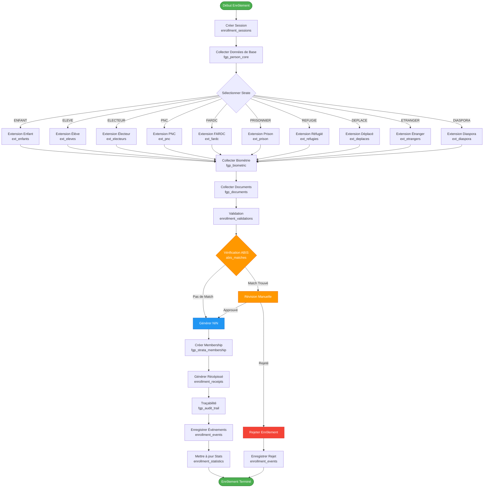
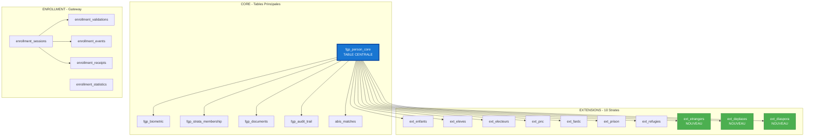

# 📊 DIAGRAMME DE LA BASE DE DONNÉES FGP

## 🗺️ DIAGRAMME MERMAID - RELATIONS ENTRE TABLES

```mermaid
erDiagram
    %% ============================================
    %% TABLE PRINCIPALE - FGP CORE
    %% ============================================
    fgp_person_core {
        VARCHAR nin PK "CD-YYYY-NNNN-NNNNNNNNN"
        TEXT nom
        TEXT postnom
        TEXT prenom
        CHAR sexe "M/F"
        DATE date_naissance
        TEXT lieu_naissance
        TEXT province_naissance
        TEXT nationalite
        VARCHAR statut_matrimonial
        TEXT nom_pere
        TEXT nom_mere
        TEXT province_residence
        TEXT territoire_residence
        TEXT commune_residence
        TEXT quartier_residence
        TEXT avenue_residence
        TEXT numero_residence
        VARCHAR telephone
        VARCHAR email
        TEXT profession
        VARCHAR niveau_etude
        VARCHAR type_piece_identite
        VARCHAR numero_piece_identite
        DATE date_emission_piece
        TEXT lieu_emission_piece
        TIMESTAMPTZ created_at
        TIMESTAMPTZ updated_at
    }

    %% ============================================
    %% BIOMÉTRIE
    %% ============================================
    fgp_biometric {
        UUID id PK
        VARCHAR nin FK "UNIQUE"
        TEXT photo_uri
        VARCHAR photo_hash
        DECIMAL photo_quality
        TEXT fingerprints_uri
        VARCHAR fingerprints_hash
        DECIMAL fingerprints_quality
        TEXT iris_uri
        VARCHAR iris_hash
        DECIMAL iris_quality
        TEXT signature_uri
        VARCHAR signature_hash
        TIMESTAMPTZ created_at
        TIMESTAMPTZ updated_at
    }

    %% ============================================
    %% APPARTENANCE AUX STRATES
    %% ============================================
    fgp_strata_membership {
        UUID id
        VARCHAR nin FK
        VARCHAR strate_code "ENFANT|ELEVE|ELECTEUR|PNC|FARDC|PRISONNIER|REFUGIE|DEPLACE|ETRANGER|DIASPORA"
        DATE valid_from
        DATE valid_to
        VARCHAR status "ACTIVE|INACTIVE|SUSPENDED"
        TIMESTAMPTZ created_at
        VARCHAR created_by
    }

    %% ============================================
    %% DOCUMENTS
    %% ============================================
    fgp_documents {
        UUID id PK
        VARCHAR nin FK
        VARCHAR document_type
        TEXT document_uri
        VARCHAR document_hash
        BIGINT file_size
        VARCHAR mime_type
        BOOLEAN is_verified
        VARCHAR verified_by
        TIMESTAMPTZ verified_at
        TIMESTAMPTZ created_at
        VARCHAR created_by
    }

    %% ============================================
    %% AUDIT TRAIL
    %% ============================================
    fgp_audit_trail {
        UUID id PK
        VARCHAR nin FK
        VARCHAR action "CREATE|UPDATE|DELETE|VIEW"
        VARCHAR table_name
        JSONB old_values
        JSONB new_values
        VARCHAR user_id
        INET user_ip
        TEXT user_agent
        TIMESTAMPTZ timestamp
    }

    %% ============================================
    %% ABIS - DÉDUPLICATION BIOMÉTRIQUE
    %% ============================================
    abis_matches {
        UUID id PK
        VARCHAR nin_candidate FK
        VARCHAR nin_existing FK
        VARCHAR match_type "face|fingerprint|iris"
        DECIMAL similarity_score
        DECIMAL threshold
        VARCHAR decision "HIT|NO_HIT|REVIEW"
        VARCHAR reviewed_by
        TIMESTAMPTZ reviewed_at
        VARCHAR review_decision
        TEXT review_notes
        TIMESTAMPTZ created_at
    }

    %% ============================================
    %% EXTENSIONS - ÉLÈVES
    %% ============================================
    ext_eleves {
        VARCHAR nin PK_FK
        VARCHAR matricule_scolaire UNIQUE
        TEXT etablissement
        VARCHAR code_etablissement
        VARCHAR niveau
        VARCHAR cycle
        VARCHAR annee_scolaire
        VARCHAR section
        VARCHAR statut_scolaire
        TEXT responsable_tuteur
        VARCHAR contact_tuteur
        VARCHAR lien_tuteur
        TIMESTAMPTZ created_at
        TIMESTAMPTZ updated_at
    }

    %% ============================================
    %% EXTENSIONS - ÉLECTEURS
    %% ============================================
    ext_electeurs {
        VARCHAR nin PK_FK
        TEXT centre_vote
        VARCHAR code_centre_vote
        TEXT circonscription
        TEXT secteur_vote
        VARCHAR statut_inscription
        DATE date_inscription_ceni
        VARCHAR bureau_vote
        TIMESTAMPTZ created_at
        TIMESTAMPTZ updated_at
    }

    %% ============================================
    %% EXTENSIONS - PNC (POLICE)
    %% ============================================
    ext_pnc {
        VARCHAR nin PK_FK
        VARCHAR matricule_pnc UNIQUE
        VARCHAR grade
        TEXT unite
        TEXT fonction
        DATE date_integration
        VARCHAR statut_service
        TEXT zone_affectation
        VARCHAR type_arme
        TIMESTAMPTZ created_at
        TIMESTAMPTZ updated_at
    }

    %% ============================================
    %% EXTENSIONS - FARDC (MILITAIRES)
    %% ============================================
    ext_fardc {
        VARCHAR nin PK_FK
        VARCHAR matricule_fardc UNIQUE
        VARCHAR grade
        TEXT unite_affectation
        TEXT zone_operation
        TEXT fonction
        DATE date_integration
        VARCHAR statut_militaire
        VARCHAR type_mission
        TIMESTAMPTZ created_at
        TIMESTAMPTZ updated_at
    }

    %% ============================================
    %% EXTENSIONS - PRISONNIERS
    %% ============================================
    ext_prison {
        VARCHAR nin PK_FK
        VARCHAR numero_dossier_judiciaire UNIQUE
        TEXT centre_detention
        VARCHAR statut_detention
        DATE date_incarceration
        DATE date_liberation_prevue
        TEXT infraction
        TEXT autorite_judiciaire
        TIMESTAMPTZ created_at
        TIMESTAMPTZ updated_at
    }

    %% ============================================
    %% EXTENSIONS - RÉFUGIÉS
    %% ============================================
    ext_refugies {
        VARCHAR nin PK_FK
        VARCHAR numero_hcr UNIQUE
        TEXT pays_origine
        VARCHAR statut_juridique
        VARCHAR document_sejour
        DATE date_entree_territoire
        TEXT camp_refugie
        VARCHAR organisme_encadrement
        TIMESTAMPTZ created_at
        TIMESTAMPTZ updated_at
    }

    %% ============================================
    %% EXTENSIONS - ENFANTS
    %% ============================================
    ext_enfants {
        VARCHAR nin PK_FK
        TEXT tuteur_nom
        VARCHAR tuteur_nin
        VARCHAR lien_tuteur
        TEXT adresse_tuteur
        VARCHAR document_parentalite
        BOOLEAN autorisation_parentale
        TEXT structure_accueil
        TIMESTAMPTZ created_at
        TIMESTAMPTZ updated_at
    }

    %% ============================================
    %% EXTENSIONS - ÉTRANGERS (NOUVEAU)
    %% ============================================
    ext_etrangers {
        VARCHAR nin PK_FK
        TEXT pays_origine
        VARCHAR numero_passeport
        TEXT ville_delivrance
        DATE date_delivrance
        DATE date_expiration
        VARCHAR numero_visa_permis
        DATE date_visa
        VARCHAR type_sejour
        TEXT adresse_residence_rdc
        TEXT profession_rdc
        TEXT employeur_organisation
        TIMESTAMPTZ created_at
        TIMESTAMPTZ updated_at
    }

    %% ============================================
    %% EXTENSIONS - DÉPLACÉS INTERNES (NOUVEAU)
    %% ============================================
    ext_deplaces {
        VARCHAR nin PK_FK
        TEXT lieu_origine
        VARCHAR province_origine
        VARCHAR territoire_origine
        TEXT raison_deplacement
        DATE date_deplacement
        TEXT site_camp_deplaces
        VARCHAR numero_carte_deplace
        VARCHAR organisme_assistance
        VARCHAR type_hebergement
        VARCHAR chef_menage_nin
        TEXT situation_sanitaire
        TEXT besoins_prioritaires
        TIMESTAMPTZ created_at
        TIMESTAMPTZ updated_at
    }

    %% ============================================
    %% EXTENSIONS - DIASPORA (NOUVEAU)
    %% ============================================
    ext_diaspora {
        VARCHAR nin PK_FK
        VARCHAR pays_residence_actuelle
        VARCHAR ville_residence
        DATE date_depart_rdc
        VARCHAR type_residence
        VARCHAR document_etranger
        VARCHAR numero_document_etranger
        TEXT profession_etranger
        TEXT employeur_etranger
        BOOLEAN souhait_retour
        DATE date_retour_prevue
        TEXT representation_consulaire
        VARCHAR ville_consulat
        VARCHAR statut_legal_etranger
        BOOLEAN double_nationalite
        VARCHAR pays_autre_nationalite
        TIMESTAMPTZ created_at
        TIMESTAMPTZ updated_at
    }

    %% ============================================
    %% ENROLLMENT GATEWAY
    %% ============================================
    enrollment_sessions {
        UUID id PK
        VARCHAR session_id UNIQUE
        VARCHAR channel
        VARCHAR device_id
        VARCHAR operator_id
        JSONB location
        JSONB payload
        VARCHAR payload_hash
        TEXT payload_signature
        VARCHAR status
        INT progress_percentage
        VARCHAR nin
        VARCHAR fgp_core_status
        JSONB extensions_status
        JSONB abis_result
        TEXT error_message
        JSONB validation_errors
        TIMESTAMPTZ created_at
        TIMESTAMPTZ updated_at
        TIMESTAMPTZ completed_at
        INT processing_time_ms
    }

    enrollment_validations {
        UUID id PK
        UUID session FK
        VARCHAR validation_type
        VARCHAR status
        JSONB validation_rules
        JSONB validation_result
        JSONB error_details
        TIMESTAMPTZ created_at
        TIMESTAMPTZ completed_at
        INT processing_time_ms
    }

    enrollment_events {
        UUID id PK
        UUID session FK
        VARCHAR event_type
        JSONB event_data
        TEXT message
        TIMESTAMPTZ created_at
        VARCHAR created_by
    }

    enrollment_receipts {
        UUID id PK
        UUID session FK "UNIQUE"
        VARCHAR nin
        VARCHAR receipt_number UNIQUE
        JSONB receipt_content
        VARCHAR receipt_pdf_url
        TEXT qr_code_data
        VARCHAR qr_code_url
        TIMESTAMPTZ created_at
        TIMESTAMPTZ expires_at
    }

    enrollment_statistics {
        INT id PK
        DATE date
        VARCHAR channel
        INT total_sessions
        INT completed_sessions
        INT failed_sessions
        INT abis_hits
        INT abis_reviews
        INT avg_processing_time_ms
        INT min_processing_time_ms
        INT max_processing_time_ms
        TIMESTAMPTZ created_at
    }

    %% ============================================
    %% RELATIONS
    %% ============================================
    
    %% Relations FGP Core
    fgp_person_core ||--o| fgp_biometric : "has biometric data"
    fgp_person_core ||--o{ fgp_strata_membership : "belongs to strata"
    fgp_person_core ||--o{ fgp_documents : "has documents"
    fgp_person_core ||--o{ fgp_audit_trail : "has audit trail"
    fgp_person_core ||--o{ abis_matches : "candidate in"
    fgp_person_core ||--o{ abis_matches : "existing in"
    
    %% Relations Extensions
    fgp_person_core ||--o| ext_eleves : "has education extension"
    fgp_person_core ||--o| ext_electeurs : "has electoral extension"
    fgp_person_core ||--o| ext_pnc : "has PNC extension"
    fgp_person_core ||--o| ext_fardc : "has FARDC extension"
    fgp_person_core ||--o| ext_prison : "has prison extension"
    fgp_person_core ||--o| ext_refugies : "has refugee extension"
    fgp_person_core ||--o| ext_enfants : "has child extension"
    fgp_person_core ||--o| ext_etrangers : "has foreigner extension"
    fgp_person_core ||--o| ext_deplaces : "has IDP extension"
    fgp_person_core ||--o| ext_diaspora : "has diaspora extension"
    
    %% Relations Enrollment
    enrollment_sessions ||--o{ enrollment_validations : "has validations"
    enrollment_sessions ||--o{ enrollment_events : "has events"
    enrollment_sessions ||--o| enrollment_receipts : "generates receipt"
```

---

## 📈 DIAGRAMME DE FLUX - PROCESSUS D'ENRÔLEMENT



---

## 🔗 DIAGRAMME DE DÉPENDANCES - TABLES



---

## 📊 STATISTIQUES DE LA BASE DE DONNÉES

### **Tables par Catégorie**

| Catégorie | Nombre | Tables |
|---|---|---|
| **Core FGP** | 5 | fgp_person_core, fgp_biometric, fgp_strata_membership, fgp_documents, fgp_audit_trail |
| **Extensions** | 10 | ext_enfants, ext_eleves, ext_electeurs, ext_pnc, ext_fardc, ext_prison, ext_refugies, ext_etrangers, ext_deplaces, ext_diaspora |
| **ABIS** | 1 | abis_matches |
| **Enrollment** | 5 | enrollment_sessions, enrollment_validations, enrollment_events, enrollment_receipts, enrollment_statistics |
| **Django** | 10 | auth_*, django_* |
| **TOTAL** | **31** | |

### **Relations par Table**

| Table | Relations Sortantes | Relations Entrantes |
|---|---|---|
| **fgp_person_core** | 0 | 16 (toutes les extensions + système) |
| **fgp_strata_membership** | 1 (vers person_core) | 0 |
| **ext_* (chaque extension)** | 1 (vers person_core) | 0 |
| **enrollment_sessions** | 0 | 3 (validations, events, receipts) |
| **abis_matches** | 2 (candidate + existing) | 0 |

### **Types de Relations**

- **One-to-One (1:1)** : 11 relations
  - fgp_person_core ↔ fgp_biometric
  - fgp_person_core ↔ chaque extension (10)
  
- **One-to-Many (1:N)** : 8 relations
  - fgp_person_core ↔ fgp_strata_membership
  - fgp_person_core ↔ fgp_documents
  - fgp_person_core ↔ fgp_audit_trail
  - fgp_person_core ↔ abis_matches (candidate)
  - fgp_person_core ↔ abis_matches (existing)
  - enrollment_sessions ↔ enrollment_validations
  - enrollment_sessions ↔ enrollment_events
  - enrollment_sessions ↔ enrollment_receipts

---

## 🔐 CONTRAINTES ET INDEX

### **Contraintes CHECK**

```sql
-- fgp_person_core
CHECK (nin ~ '^CD-[0-9]{4}-[0-9]{4}-[0-9]{9}$')
CHECK (sexe IN ('M', 'F'))

-- fgp_strata_membership
CHECK (strate_code IN ('ENFANT', 'ELEVE', 'ELECTEUR', 'PNC', 'FARDC', 
                       'PRISONNIER', 'REFUGIE', 'DEPLACE', 'ETRANGER', 'DIASPORA'))
CHECK (status IN ('ACTIVE', 'INACTIVE', 'SUSPENDED'))

-- abis_matches
CHECK (decision IN ('HIT', 'NO_HIT', 'REVIEW'))
```

### **Index Principaux**

```sql
-- fgp_person_core
idx_fgp_person_core_nom
idx_fgp_person_core_prenom
idx_fgp_person_core_date_naissance
idx_fgp_person_core_province
idx_fgp_person_core_telephone

-- fgp_strata_membership
idx_fgp_strata_membership_strate
idx_fgp_strata_membership_status

-- fgp_documents
idx_documents_nin
idx_documents_type

-- fgp_audit_trail
idx_audit_trail_nin
idx_audit_trail_action
idx_audit_trail_timestamp

-- abis_matches
idx_abis_matches_candidate
idx_abis_matches_existing
idx_abis_matches_decision

-- enrollment_sessions
idx_enrollment_sessions_session_id
idx_enrollment_sessions_status
idx_enrollment_sessions_channel
idx_enrollment_sessions_created_at
```

---

## 📐 CARDINALITÉS

```
fgp_person_core (1) ──────── (0..1) fgp_biometric
fgp_person_core (1) ──────── (0..N) fgp_strata_membership
fgp_person_core (1) ──────── (0..N) fgp_documents
fgp_person_core (1) ──────── (0..N) fgp_audit_trail
fgp_person_core (1) ──────── (0..1) ext_enfants
fgp_person_core (1) ──────── (0..1) ext_eleves
fgp_person_core (1) ──────── (0..1) ext_electeurs
fgp_person_core (1) ──────── (0..1) ext_pnc
fgp_person_core (1) ──────── (0..1) ext_fardc
fgp_person_core (1) ──────── (0..1) ext_prison
fgp_person_core (1) ──────── (0..1) ext_refugies
fgp_person_core (1) ──────── (0..1) ext_etrangers
fgp_person_core (1) ──────── (0..1) ext_deplaces
fgp_person_core (1) ──────── (0..1) ext_diaspora

enrollment_sessions (1) ──── (0..N) enrollment_validations
enrollment_sessions (1) ──── (0..N) enrollment_events
enrollment_sessions (1) ──── (0..1) enrollment_receipts
```

---

**Légende** :
- 🟦 Tables Core (bleues) - Données principales
- 🟩 Nouvelles tables (vertes) - Ajoutées récemment
- 🟧 Tables Enrollment (oranges) - Gateway d'enrôlement
- PK = Primary Key
- FK = Foreign Key
- UNIQUE = Contrainte d'unicité


