# 📊 Diagramme Mermaid - MCD OSIA Complet

## Diagramme MCD (Modèle Conceptuel de Données) - Notation Merise

```mermaid
erDiagram
    %% ============================================
    %% ENTITÉS CORE - POPULATION REGISTRY
    %% ============================================
    
    PERSONNE {
        string personId PK "NIN - Format CD-YYYY-NNNN-NNNNNNNNN"
        string givenName "Prénom"
        string familyName "Nom"
        string middleName "Postnom"
        date dateOfBirth "Date de naissance"
        char gender "Sexe: M/F"
        string nationality "Nationalité"
        string placeOfBirth "Lieu de naissance"
        string maritalStatus "Statut matrimonial"
        string registrationStatus "Statut d'enregistrement"
    }
    
    ADRESSE {
        uuid addressId PK
        string addressType "RÉSIDENCE | NAISSANCE | AUTRE"
        string country "Pays"
        string stateProvince "Province/État"
        string district "District/Territoire"
        string city "Ville/Commune"
        string postalCode "Code postal"
        string street "Rue/Avenue"
        string streetNumber "Numéro"
    }
    
    CONTACT {
        uuid contactId PK
        string telephone "Téléphone fixe"
        string mobilePhone "Téléphone mobile"
        string email "Adresse email"
        string postOfficeBox "Boîte postale"
    }
    
    DOCUMENT_IDENTITE {
        uuid documentId PK
        string documentType "ACTE_NAISSANCE | CARTE_ID | PASSEPORT"
        string documentNumber "Numéro du document"
        string issuingAuthority "Autorité émettrice"
        date dateOfIssue "Date d'émission"
        date dateOfExpiry "Date d'expiration"
        string placeOfIssue "Lieu d'émission"
        string documentImageUri "URI du document"
    }
    
    %% ============================================
    %% PARENTALITÉ
    %% ============================================
    
    PARENT {
        uuid parentId PK
        string relationshipType "PÈRE | MÈRE | TUTEUR | AUTRE"
        int order "Ordre - pour cas spéciaux"
    }
    
    %% ============================================
    %% BIOMÉTRIE
    %% ============================================
    
    GABARIT_BIOMETRIQUE {
        uuid templateId PK
        string biometricType "FACE | FINGERPRINT | IRIS | VOICE"
        binary templateData "Données du gabarit"
        string templateFormat "Format: ISO | ANSI"
        decimal qualityScore "Score qualité 0.0-1.0"
        datetime captureDate "Date de capture"
        string captureDevice "Identifiant dispositif"
        string captureLocation "Lieu de capture"
    }
    
    CORRESPONDANCE_BIOMETRIQUE {
        uuid matchId PK
        string matchType "FACE | FINGERPRINT | IRIS | MULTIMODAL"
        decimal similarityScore "Score similarité 0.0-1.0"
        decimal threshold "Seuil de décision"
        string decision "HIT | NO_HIT | REVIEW"
        string reviewStatus "PENDING | APPROVED | REJECTED"
        string reviewedBy "Révisé par"
        datetime reviewedAt "Date de révision"
        string reviewNotes "Notes de révision"
    }
    
    %% ============================================
    %% REGISTRE CIVIL
    %% ============================================
    
    EVENEMENT_VITAL {
        uuid eventId PK
        string eventType "NAISSANCE | DÉCÈS | MARIAGE | DIVORCE | ADOPTION"
        date eventDate "Date de l'événement"
        string eventLocation "Lieu de l'événement"
        string registrationNumber "Numéro d'enregistrement"
        date registrationDate "Date d'enregistrement"
        string registeringAuthority "Autorité enregistrante"
    }
    
    EVENEMENT_NAISSANCE {
        uuid birthEventId PK
        decimal birthWeight "Poids de naissance"
        time birthTime "Heure de naissance"
        int birthOrder "Ordre de naissance"
    }
    
    EVENEMENT_DECES {
        uuid deathEventId PK
        string causeOfDeath "Cause du décès"
        string certifyingPhysician "Médecin certifiant"
    }
    
    EVENEMENT_MARIAGE {
        uuid marriageEventId PK
        string marriageType "CIVIL | RELIGIEUX | COUTUMIER"
        date divorceDate "Date de divorce"
    }
    
    %% ============================================
    %% REGISTRES FONCTIONNELS
    %% ============================================
    
    STRATE {
        string strateCode PK "ELEVE | ETUDIANT | ELECTEUR | PNC | FARDC"
        string strateName "Nom de la strate"
        string strateDescription "Description"
    }
    
    APPARTENANCE_STRATE {
        uuid membershipId PK
        date validFrom "Date début validité"
        date validTo "Date fin validité"
        string status "ACTIVE | INACTIVE | SUSPENDED"
        string registryReference "Référence registre source"
    }
    
    %% ============================================
    %% IDENTITY GATEWAY
    %% ============================================
    
    SESSION_ENROLEMENT {
        uuid sessionId PK
        string channel "FIXED | MOBILE | ITINERANT | ONLINE"
        string deviceId "Identifiant dispositif"
        string operatorId "Identifiant opérateur"
        string location "Coordonnées GPS"
        string payloadHash "Hash du payload"
        string payloadSignature "Signature JWS"
        string status "PENDING | PROCESSING | COMPLETED | FAILED"
        int progressPercentage "Pourcentage progression"
        datetime createdAt "Date de création"
        datetime completedAt "Date de completion"
    }
    
    REQUETE_IDENTITE {
        uuid requestId PK
        string requestType "VERIFY | SEARCH | ENROLL | UPDATE | DELETE"
        string requestorId "Identifiant demandeur"
        datetime timestamp "Horodatage"
        string status "Statut"
    }
    
    VALIDATION {
        uuid validationId PK
        string validationType "DATA | BIOMETRIC | DOCUMENT | BUSINESS_RULE"
        string status "PASSED | FAILED | WARNING"
        json validationRules "Règles de validation"
    }
    
    %% ============================================
    %% CREDENTIAL MANAGEMENT
    %% ============================================
    
    CREDENTIAL {
        uuid credentialId PK
        string credentialType "CARTE_NATIONALE | PASSEPORT | PERMIS_CONDUITE"
        string credentialNumber "Numéro credential"
        date issueDate "Date d'émission"
        date expiryDate "Date d'expiration"
        string issuingAuthority "Autorité émettrice"
        string status "ACTIVE | EXPIRED | REVOKED | SUSPENDED"
    }
    
    %% ============================================
    %% MONÉTISATION
    %% ============================================
    
    CLIENT {
        uuid clientId PK
        string clientCode UK "Code client unique"
        string clientName "Nom du client"
        string clientType "BANQUE | ASSURANCE | TELCO | GOUVERNEMENT | PRIVÉ"
        string billingModel "TRANSACTIONNEL | ABONNEMENT | HYBRIDE"
        decimal creditLimit "Limite de crédit"
        decimal currentBalance "Solde actuel"
        string status "ACTIF | SUSPENDU | BLOQUÉ"
        date contractStartDate "Date début contrat"
        date contractEndDate "Date fin contrat"
    }
    
    CLE_API {
        uuid keyId PK
        string apiKey UK "Clé API publique"
        string apiSecretHash "Hash clé secrète"
        json permissions "Permissions"
        int rateLimit "Limite requêtes/heure"
        string_array ipWhitelist "Liste IP autorisées"
        string status "ACTIF | EXPIRÉ | RÉVOQUÉ"
        datetime expiresAt "Date expiration"
    }
    
    TARIF {
        uuid pricingId PK
        string transactionType UK "IDENTITY_VERIFY | BIOMETRIC_VERIFY | IRIS_VERIFY"
        decimal basePrice "Prix de base"
        string currency "USD | CDF"
        string clientType "Type client - optionnel"
        int volumeDiscountThreshold "Seuil remise volume"
        decimal volumeDiscountPercentage "Pourcentage remise"
        date validFrom "Date début validité"
        date validTo "Date fin validité"
    }
    
    TRANSACTION {
        uuid transactionId PK
        string transactionType "Type de transaction"
        string apiEndpoint "Endpoint appelé"
        datetime requestTimestamp "Horodatage requête"
        string responseStatus "SUCCESS | FAILED | ERROR"
        int responseTimeMs "Temps réponse ms"
        decimal amount "Montant facturé"
        string currency "Devise"
        string billingStatus "PENDING | INVOICED | PAID"
        string personId FK "NIN - optionnel"
    }
    
    ABONNEMENT {
        uuid subscriptionId PK
        string planType "STARTER | BUSINESS | ENTERPRISE | UNLIMITED"
        int quotaMonthly "Quota mensuel"
        int usedQuota "Quota utilisé"
        string billingCycle "MENSUEL | TRIMESTRIEL | ANNUEL"
        date startDate "Date début"
        date endDate "Date fin"
        boolean autoRenew "Renouvellement automatique"
        string status "ACTIF | EXPIRÉ | SUSPENDU"
    }
    
    FACTURE {
        uuid invoiceId PK
        string invoiceNumber UK "Numéro facture unique"
        date billingPeriodStart "Début période"
        date billingPeriodEnd "Fin période"
        decimal totalAmount "Montant total"
        decimal taxAmount "Montant taxes"
        decimal totalWithTax "Total TTC"
        string currency "Devise"
        string status "DRAFT | SENT | PAID | OVERDUE"
        date dueDate "Date échéance"
        date paidDate "Date paiement"
        string paymentReference "Référence paiement"
    }
    
    %% ============================================
    %% RELATIONS - CORE
    %% ============================================
    
    PERSONNE ||--o{ ADRESSE : "habite à"
    PERSONNE ||--o| CONTACT : "a pour contact"
    PERSONNE ||--o{ DOCUMENT_IDENTITE : "possède"
    PERSONNE ||--o{ GABARIT_BIOMETRIQUE : "a pour gabarit"
    PERSONNE ||--o{ APPARTENANCE_STRATE : "appartient à"
    PERSONNE ||--o{ EVENEMENT_VITAL : "a pour événement"
    PERSONNE ||--o{ SESSION_ENROLEMENT : "enregistrée via"
    PERSONNE ||--o{ CREDENTIAL : "possède"
    
    %% Relations Parentalité
    PERSONNE ||--o{ PARENT : "est parent de"
    PERSONNE ||--o{ PARENT : "a pour parent"
    
    %% Relations Biométrie
    PERSONNE ||--o{ CORRESPONDANCE_BIOMETRIQUE : "candidate dans"
    PERSONNE ||--o{ CORRESPONDANCE_BIOMETRIQUE : "matched dans"
    
    %% Relations Strates
    STRATE ||--o{ APPARTENANCE_STRATE : "contient"
    
    %% Relations Événements Vitaux
    EVENEMENT_VITAL ||--o| EVENEMENT_NAISSANCE : "spécialisation"
    EVENEMENT_VITAL ||--o| EVENEMENT_DECES : "spécialisation"
    EVENEMENT_VITAL ||--o| EVENEMENT_MARIAGE : "spécialisation"
    
    PERSONNE ||--o{ EVENEMENT_NAISSANCE : "naît via"
    PERSONNE ||--o{ EVENEMENT_NAISSANCE : "père de"
    PERSONNE ||--o{ EVENEMENT_NAISSANCE : "mère de"
    PERSONNE ||--o{ EVENEMENT_DECES : "décède via"
    PERSONNE ||--o{ EVENEMENT_MARIAGE : "époux 1"
    PERSONNE ||--o{ EVENEMENT_MARIAGE : "époux 2"
    
    %% Relations Gateway
    SESSION_ENROLEMENT ||--o{ VALIDATION : "contient"
    REQUETE_IDENTITE ||--o| TRANSACTION : "génère"
    
    %% ============================================
    %% RELATIONS - MONÉTISATION
    %% ============================================
    
    CLIENT ||--o{ CLE_API : "possède"
    CLIENT ||--o{ TRANSACTION : "effectue"
    CLIENT ||--o| ABONNEMENT : "a un abonnement"
    CLIENT ||--o{ FACTURE : "reçoit"
    
    TRANSACTION }o--|| TARIF : "utilise"
    TRANSACTION }o--o| PERSONNE : "concernant"
    TRANSACTION }o--|| REQUETE_IDENTITE : "correspond à"
    TRANSACTION }o--|| FACTURE : "inclus dans"
```

---

## 📝 Notes sur le Diagramme

### Cardinalités utilisées:
- `||--o{` : Un à plusieurs (1:N) - Un côté, plusieurs de l'autre
- `||--o|` : Un à zéro ou un (1:0..1) - Un côté, zéro ou un de l'autre
- `}o--||` : Plusieurs à un (N:1) - Plusieurs d'un côté, un de l'autre
- `}o--o|` : Plusieurs à zéro ou un (N:0..1)

### Relations spéciales:
- **PARENT** : Relation récursive sur PERSONNE (parent ↔ enfant)
- **CORRESPONDANCE_BIOMETRIQUE** : Lien entre deux PERSONNE (candidate ↔ matched)
- **EVENEMENT_VITAL** : Relations spécialisées avec héritage

---

**Date de création**: $(date)  
**Conforme à**: MCD OSIA - Modèle Conceptuel de Données  
**Format**: Mermaid ERD (Entity Relationship Diagram)

