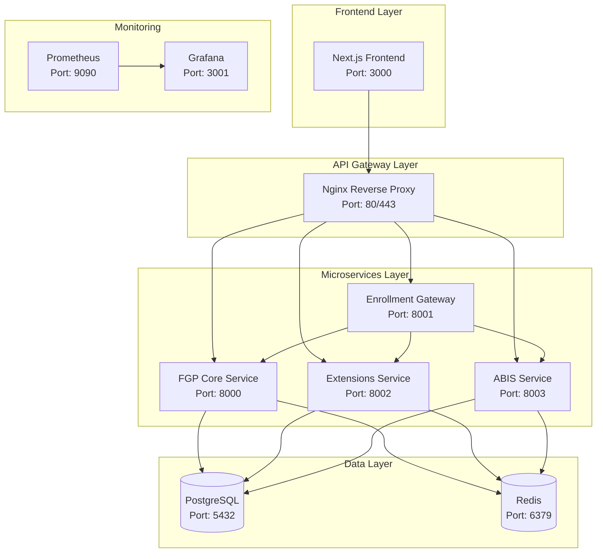

# 🏗️ Architecture Technique - Système FGP

## Vue d'ensemble

Le système FGP (Fichier Général de la Population) est conçu comme une architecture de microservices pour gérer l'identification nationale de la population de la RDC.

## Architecture Générale



## Microservices

### 1. FGP Core Service (Port 8000)
**Responsabilité** : Gestion du noyau FGP (27 variables obligatoires)

**Fonctionnalités** :
- CRUD des personnes FGP
- Génération des NIN
- Gestion des appartenances aux strates
- Gestion des documents
- API de recherche et consultation

**Endpoints principaux** :
- `GET /api/v1/core/persons/` - Liste des personnes
- `POST /api/v1/core/persons/` - Création d'une personne
- `GET /api/v1/core/persons/{nin}/` - Détails d'une personne
- `GET /api/v1/core/search/` - Recherche de personnes

### 2. Enrollment Gateway (Port 8001)
**Responsabilité** : Point d'entrée unique pour l'enrôlement

**Fonctionnalités** :
- Validation des données d'enrôlement
- Orchestration des services
- Gestion des flux d'enrôlement
- Intégration ABIS
- Génération des récépissés

**Endpoints principaux** :
- `POST /api/v1/enrolments/` - Enrôlement complet
- `GET /api/v1/enrolments/{id}/` - Statut d'enrôlement
- `POST /api/v1/enrolments/validate/` - Validation préalable

### 3. Extensions Service (Port 8002)
**Responsabilité** : Gestion des extensions par strate

**Fonctionnalités** :
- CRUD des extensions par strate
- Validation des données spécifiques
- Synchronisation avec FGP Core
- APIs sectorielles

**Extensions supportées** :
- Élèves (ext_eleves)
- Étudiants (ext_etudiants)
- Électeurs (ext_electeurs)
- PNC (ext_pnc)
- FARDC (ext_fardc)
- Prisonniers (ext_prison)
- Réfugiés (ext_refugies)
- Enfants (ext_enfants)
- Fonctionnaires (ext_fonctionnaires)

### 4. ABIS Service (Port 8003)
**Responsabilité** : Déduplication biométrique

**Fonctionnalités** :
- Stockage des gabarits biométriques
- Recherche 1:N (déduplication)
- Calcul des scores de similarité
- Gestion des seuils de décision
- Workflow de révision manuelle

**Endpoints principaux** :
- `POST /api/v1/abis/enroll/` - Enrôlement biométrique
- `POST /api/v1/abis/search/` - Recherche 1:N
- `GET /api/v1/abis/matches/` - Correspondances trouvées

## Base de Données

### PostgreSQL - Schéma Principal

#### Tables Core
- `fgp_person_core` - 27 variables obligatoires
- `fgp_biometric` - Données biométriques
- `fgp_strata_membership` - Appartenances aux strates
- `fgp_documents` - Documents et pièces jointes
- `fgp_audit_trail` - Traçabilité complète

#### Tables Extensions
- `ext_eleves` - Extension élèves
- `ext_etudiants` - Extension étudiants
- `ext_electeurs` - Extension électeurs
- `ext_pnc` - Extension police
- `ext_fardc` - Extension armée
- `ext_prison` - Extension prisonniers
- `ext_refugies` - Extension réfugiés
- `ext_enfants` - Extension enfants
- `ext_fonctionnaires` - Extension fonctionnaires

#### Tables ABIS
- `fgp_biometric_templates` - Gabarits biométriques
- `abis_matches` - Résultats de correspondance

### Redis - Cache et Sessions
- Cache des requêtes fréquentes
- Sessions utilisateur
- Files d'attente pour tâches asynchrones
- Stockage temporaire des données d'enrôlement

## Sécurité

### Authentification et Autorisation
- **JWT** pour l'authentification API
- **RBAC/ABAC** pour le contrôle d'accès
- **PKI ONIP** pour la signature des données
- **HTTPS/TLS 1.3** pour le chiffrement en transit

### Chiffrement
- **AES-256** pour le chiffrement au repos
- **HSM** pour la gestion des clés biométriques
- **Hash SHA-256** pour l'intégrité des documents

### Audit et Conformité
- **Journalisation WORM** (Write Once Read Many)
- **Traçabilité complète** de toutes les opérations
- **Rétention des données** selon la réglementation
- **Minimisation des données** par secteur

## Déploiement

### Docker Compose
Le système est entièrement containerisé avec Docker Compose :

```yaml
services:
  postgres:     # Base de données principale
  redis:        # Cache et sessions
  fgp_core:     # Service FGP Core
  enrollment_gateway:  # Gateway d'enrôlement
  extensions_service:  # Service extensions
  abis_service: # Service ABIS
  frontend:     # Interface Next.js
  nginx:        # Reverse proxy
  prometheus:   # Monitoring
  grafana:      # Tableaux de bord
```

### Variables d'Environnement
- `DATABASE_URL` - URL de connexion PostgreSQL
- `REDIS_URL` - URL de connexion Redis
- `SECRET_KEY` - Clé secrète Django
- `ALLOWED_HOSTS` - Hôtes autorisés
- `CORS_ALLOWED_ORIGINS` - Origines CORS autorisées

## Monitoring et Observabilité

### Métriques
- **Prometheus** pour la collecte des métriques
- **Grafana** pour la visualisation
- Métriques applicatives (requêtes, erreurs, latence)
- Métriques système (CPU, mémoire, disque)
- Métriques base de données (connexions, requêtes lentes)

### Logs
- **Structured logging** avec JSON
- **Log levels** : DEBUG, INFO, WARNING, ERROR, CRITICAL
- **Correlation IDs** pour le traçage des requêtes
- **Rotation des logs** automatique

### Alertes
- Alertes sur les erreurs critiques
- Alertes sur les performances dégradées
- Alertes sur la disponibilité des services
- Notifications par email/SMS

## Scalabilité

### Horizontal Scaling
- **Load balancing** avec Nginx
- **Database sharding** par province/territoire
- **Cache distribution** avec Redis Cluster
- **Microservices** indépendants et scalables

### Performance
- **Indexation** optimisée des requêtes fréquentes
- **Cache** des données de référence
- **Pagination** pour les grandes listes
- **Compression** des réponses API

## Intégration

### APIs Externes
- **CENI** - Système électoral
- **MENPS** - Ministère de l'Éducation
- **HCR** - Haut Commissariat aux Réfugiés
- **Systèmes sectoriels** - PNC, FARDC, etc.

### Formats d'Échange
- **JSON** pour les APIs REST
- **XML** pour l'intégration avec les systèmes legacy
- **CSV** pour l'import/export de données
- **PDF** pour les récépissés et rapports

## Maintenance

### Sauvegarde
- **Backup quotidien** de la base de données
- **Backup incrémental** des fichiers
- **Test de restauration** mensuel
- **Stockage externe** sécurisé

### Mise à jour
- **Déploiement continu** avec GitLab CI/CD
- **Tests automatisés** avant déploiement
- **Rollback automatique** en cas d'échec
- **Maintenance programmée** en dehors des heures de pointe
