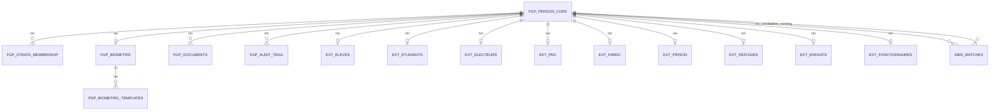

# 🗄️ Documentation Base de Données - Système FGP

## Vue d'ensemble

Le système FGP utilise PostgreSQL comme base de données principale avec un schéma relationnel optimisé pour la gestion de l'identification nationale.

## Architecture de la Base de Données

### Schéma Principal



## Tables Principales

### 1. FGP_PERSON_CORE

Table centrale contenant les 27 variables obligatoires du FGP.

| Colonne | Type | Contraintes | Description |
|---------|------|-------------|-------------|
| nin | VARCHAR(20) | PK, UNIQUE | Numéro d'Identification Nationale |
| nom | TEXT | NOT NULL | Nom de famille |
| postnom | TEXT | | Postnom |
| prenom | TEXT | NOT NULL | Prénom |
| sexe | CHAR(1) | NOT NULL, CHECK | Sexe (M/F) |
| date_naissance | DATE | NOT NULL | Date de naissance |
| lieu_naissance | TEXT | NOT NULL | Lieu de naissance |
| province_naissance | TEXT | NOT NULL | Province de naissance |
| nationalite | TEXT | NOT NULL | Nationalité |
| statut_matrimonial | VARCHAR(20) | CHECK | Statut matrimonial |
| nom_pere | TEXT | | Nom du père |
| nom_mere | TEXT | | Nom de la mère |
| province_residence | TEXT | NOT NULL | Province de résidence |
| territoire_residence | TEXT | | Territoire de résidence |
| commune_residence | TEXT | | Commune de résidence |
| quartier_residence | TEXT | | Quartier de résidence |
| avenue_residence | TEXT | | Avenue de résidence |
| numero_residence | TEXT | | Numéro de résidence |
| telephone | VARCHAR(20) | | Numéro de téléphone |
| email | VARCHAR(255) | | Adresse email |
| profession | TEXT | | Profession |
| niveau_etude | VARCHAR(50) | | Niveau d'étude |
| type_piece_identite | VARCHAR(50) | | Type de pièce d'identité |
| numero_piece_identite | VARCHAR(50) | | Numéro de pièce d'identité |
| date_emission_piece | DATE | | Date d'émission de la pièce |
| lieu_emission_piece | TEXT | | Lieu d'émission de la pièce |
| created_at | TIMESTAMPTZ | DEFAULT NOW() | Date de création |
| updated_at | TIMESTAMPTZ | DEFAULT NOW() | Date de mise à jour |
| created_by | VARCHAR(100) | | Créé par |
| updated_by | VARCHAR(100) | | Mis à jour par |
| version | INTEGER | DEFAULT 1 | Version |

**Index :**
- `idx_fgp_person_core_nom` sur `nom`
- `idx_fgp_person_core_prenom` sur `prenom`
- `idx_fgp_person_core_date_naissance` sur `date_naissance`
- `idx_fgp_person_core_province` sur `province_residence`
- `idx_fgp_person_core_telephone` sur `telephone`

### 2. FGP_BIOMETRIC

Données biométriques des personnes.

| Colonne | Type | Contraintes | Description |
|---------|------|-------------|-------------|
| id | UUID | PK | Identifiant unique |
| nin | VARCHAR(20) | FK, UNIQUE | Référence vers FGP_PERSON_CORE |
| photo_uri | TEXT | | URI de la photo faciale |
| photo_hash | VARCHAR(64) | | Hash SHA-256 de la photo |
| photo_quality | DECIMAL(3,2) | CHECK | Qualité de la photo (0.0-1.0) |
| fingerprints_uri | TEXT | | URI des empreintes digitales |
| fingerprints_hash | VARCHAR(64) | | Hash SHA-256 des empreintes |
| fingerprints_quality | DECIMAL(3,2) | CHECK | Qualité des empreintes (0.0-1.0) |
| iris_uri | TEXT | | URI de l'iris |
| iris_hash | VARCHAR(64) | | Hash SHA-256 de l'iris |
| iris_quality | DECIMAL(3,2) | CHECK | Qualité de l'iris (0.0-1.0) |
| signature_uri | TEXT | | URI de la signature |
| signature_hash | VARCHAR(64) | | Hash SHA-256 de la signature |
| created_at | TIMESTAMPTZ | DEFAULT NOW() | Date de création |
| updated_at | TIMESTAMPTZ | DEFAULT NOW() | Date de mise à jour |
| created_by | VARCHAR(100) | | Créé par |

### 3. FGP_STRATA_MEMBERSHIP

Appartenance aux différentes strates.

| Colonne | Type | Contraintes | Description |
|---------|------|-------------|-------------|
| id | UUID | PK | Identifiant unique |
| nin | VARCHAR(20) | FK | Référence vers FGP_PERSON_CORE |
| strate_code | VARCHAR(20) | NOT NULL, CHECK | Code de la strate |
| valid_from | DATE | NOT NULL | Date de début de validité |
| valid_to | DATE | | Date de fin de validité |
| status | VARCHAR(20) | DEFAULT 'ACTIVE', CHECK | Statut (ACTIVE/INACTIVE/SUSPENDED) |
| created_at | TIMESTAMPTZ | DEFAULT NOW() | Date de création |
| created_by | VARCHAR(100) | | Créé par |

**Contraintes :**
- `PRIMARY KEY (nin, strate_code, valid_from)`
- `CHECK (strate_code IN ('ELEVES', 'ETUDIANTS', 'ELECTEURS', 'PNC', 'FARDC', 'PRISON', 'REFUGIE', 'ENFANT', 'FONCTIONNAIRE'))`
- `CHECK (status IN ('ACTIVE', 'INACTIVE', 'SUSPENDED'))`

**Index :**
- `idx_fgp_strata_membership_strate` sur `strate_code`
- `idx_fgp_strata_membership_status` sur `status`

## Tables d'Extension

### 1. EXT_ELEVES

Extension pour les élèves (primaire/secondaire).

| Colonne | Type | Contraintes | Description |
|---------|------|-------------|-------------|
| nin | VARCHAR(20) | PK, FK | Référence vers FGP_PERSON_CORE |
| matricule_scolaire | VARCHAR(50) | UNIQUE, NOT NULL | Matricule scolaire |
| etablissement | TEXT | NOT NULL | Nom de l'établissement |
| code_etablissement | VARCHAR(20) | | Code de l'établissement |
| niveau | VARCHAR(50) | NOT NULL | Niveau/Classe |
| cycle | VARCHAR(20) | | Cycle scolaire |
| annee_scolaire | VARCHAR(10) | NOT NULL | Année scolaire |
| section | VARCHAR(50) | | Section/Spécialité |
| statut_scolaire | VARCHAR(20) | DEFAULT 'public', CHECK | Statut scolaire |
| responsable_tuteur | TEXT | | Nom du tuteur |
| contact_tuteur | VARCHAR(20) | | Contact du tuteur |
| lien_tuteur | VARCHAR(30) | | Lien avec l'enfant |
| created_at | TIMESTAMPTZ | DEFAULT NOW() | Date de création |
| updated_at | TIMESTAMPTZ | DEFAULT NOW() | Date de mise à jour |
| created_by | VARCHAR(100) | | Créé par |

### 2. EXT_ETUDIANTS

Extension pour les étudiants (supérieur).

| Colonne | Type | Contraintes | Description |
|---------|------|-------------|-------------|
| nin | VARCHAR(20) | PK, FK | Référence vers FGP_PERSON_CORE |
| matricule_universitaire | VARCHAR(50) | UNIQUE, NOT NULL | Matricule universitaire |
| universite | TEXT | NOT NULL | Nom de l'université |
| code_universite | VARCHAR(20) | | Code de l'université |
| faculte | TEXT | | Faculté |
| departement | TEXT | | Département/Filière |
| niveau | VARCHAR(10) | CHECK | Niveau (L1, L2, L3, M1, M2, D1, D2, D3) |
| annee_academique | VARCHAR(10) | NOT NULL | Année académique |
| statut_academique | VARCHAR(20) | DEFAULT 'régulier', CHECK | Statut académique |
| residence_universitaire | BOOLEAN | DEFAULT FALSE | Résidence universitaire |
| created_at | TIMESTAMPTZ | DEFAULT NOW() | Date de création |
| updated_at | TIMESTAMPTZ | DEFAULT NOW() | Date de mise à jour |
| created_by | VARCHAR(100) | | Créé par |

### 3. EXT_ELECTEURS

Extension pour les électeurs.

| Colonne | Type | Contraintes | Description |
|---------|------|-------------|-------------|
| nin | VARCHAR(20) | PK, FK | Référence vers FGP_PERSON_CORE |
| centre_vote | TEXT | NOT NULL | Nom du centre de vote |
| code_centre_vote | VARCHAR(20) | NOT NULL | Code du centre de vote |
| circonscription | TEXT | NOT NULL | Circonscription électorale |
| secteur_vote | TEXT | NOT NULL | Secteur de vote |
| statut_inscription | VARCHAR(20) | DEFAULT 'inscrit', CHECK | Statut d'inscription |
| date_inscription_ceni | DATE | NOT NULL | Date d'inscription CENI |
| bureau_vote | VARCHAR(20) | | Bureau de vote |
| created_at | TIMESTAMPTZ | DEFAULT NOW() | Date de création |
| updated_at | TIMESTAMPTZ | DEFAULT NOW() | Date de mise à jour |
| created_by | VARCHAR(100) | | Créé par |

### 4. EXT_PNC

Extension pour la Police Nationale Congolaise.

| Colonne | Type | Contraintes | Description |
|---------|------|-------------|-------------|
| nin | VARCHAR(20) | PK, FK | Référence vers FGP_PERSON_CORE |
| matricule_pnc | VARCHAR(20) | UNIQUE, NOT NULL | Matricule PNC |
| grade | VARCHAR(50) | NOT NULL | Grade |
| unite | TEXT | NOT NULL | Unité d'affectation |
| fonction | TEXT | | Fonction/Poste |
| date_integration | DATE | NOT NULL | Date d'intégration |
| statut_service | VARCHAR(20) | DEFAULT 'actif', CHECK | Statut de service |
| zone_affectation | TEXT | | Zone d'affectation |
| type_arme | VARCHAR(100) | | Type d'arme |
| created_at | TIMESTAMPTZ | DEFAULT NOW() | Date de création |
| updated_at | TIMESTAMPTZ | DEFAULT NOW() | Date de mise à jour |
| created_by | VARCHAR(100) | | Créé par |

### 5. EXT_FARDC

Extension pour les Forces Armées.

| Colonne | Type | Contraintes | Description |
|---------|------|-------------|-------------|
| nin | VARCHAR(20) | PK, FK | Référence vers FGP_PERSON_CORE |
| matricule_fardc | VARCHAR(20) | UNIQUE, NOT NULL | Matricule FARDC |
| grade | VARCHAR(50) | NOT NULL | Grade |
| unite_affectation | TEXT | NOT NULL | Unité d'affectation |
| zone_operation | TEXT | | Zone d'opération |
| fonction | TEXT | | Fonction/Poste |
| date_integration | DATE | NOT NULL | Date d'intégration |
| statut_militaire | VARCHAR(20) | DEFAULT 'actif', CHECK | Statut militaire |
| type_mission | VARCHAR(20) | CHECK | Type de mission |
| created_at | TIMESTAMPTZ | DEFAULT NOW() | Date de création |
| updated_at | TIMESTAMPTZ | DEFAULT NOW() | Date de mise à jour |
| created_by | VARCHAR(100) | | Créé par |

### 6. EXT_PRISON

Extension pour les prisonniers.

| Colonne | Type | Contraintes | Description |
|---------|------|-------------|-------------|
| nin | VARCHAR(20) | PK, FK | Référence vers FGP_PERSON_CORE |
| numero_dossier_judiciaire | VARCHAR(50) | UNIQUE, NOT NULL | Numéro de dossier judiciaire |
| centre_detention | TEXT | NOT NULL | Centre de détention |
| statut_detention | VARCHAR(30) | NOT NULL, CHECK | Statut de détention |
| date_incarceration | DATE | NOT NULL | Date d'incarcération |
| date_liberation_prevue | DATE | | Date de libération prévue |
| infraction | TEXT | | Nature de l'infraction |
| autorite_judiciaire | TEXT | | Autorité judiciaire |
| created_at | TIMESTAMPTZ | DEFAULT NOW() | Date de création |
| updated_at | TIMESTAMPTZ | DEFAULT NOW() | Date de mise à jour |
| created_by | VARCHAR(100) | | Créé par |

### 7. EXT_REFUGIES

Extension pour les réfugiés/apatrides.

| Colonne | Type | Contraintes | Description |
|---------|------|-------------|-------------|
| nin | VARCHAR(20) | PK, FK | Référence vers FGP_PERSON_CORE |
| numero_hcr | VARCHAR(30) | UNIQUE | Numéro HCR |
| pays_origine | TEXT | NOT NULL | Pays d'origine |
| statut_juridique | VARCHAR(30) | NOT NULL, CHECK | Statut juridique |
| document_sejour | VARCHAR(50) | | Type de document de séjour |
| date_entree_territoire | DATE | NOT NULL | Date d'entrée en RDC |
| camp_refugie | TEXT | | Nom du camp |
| organisme_encadrement | VARCHAR(50) | | Organisme d'encadrement |
| created_at | TIMESTAMPTZ | DEFAULT NOW() | Date de création |
| updated_at | TIMESTAMPTZ | DEFAULT NOW() | Date de mise à jour |
| created_by | VARCHAR(100) | | Créé par |

### 8. EXT_ENFANTS

Extension pour les enfants (mineurs non scolarisés).

| Colonne | Type | Contraintes | Description |
|---------|------|-------------|-------------|
| nin | VARCHAR(20) | PK, FK | Référence vers FGP_PERSON_CORE |
| tuteur_nom | TEXT | NOT NULL | Nom du tuteur |
| tuteur_nin | VARCHAR(20) | | NIN du tuteur |
| lien_tuteur | VARCHAR(30) | NOT NULL | Lien avec le tuteur |
| adresse_tuteur | TEXT | | Adresse du tuteur |
| document_parentalite | VARCHAR(50) | | Type de document de parentalité |
| autorisation_parentale | BOOLEAN | DEFAULT TRUE | Autorisation parentale |
| structure_accueil | TEXT | | Structure d'accueil |
| created_at | TIMESTAMPTZ | DEFAULT NOW() | Date de création |
| updated_at | TIMESTAMPTZ | DEFAULT NOW() | Date de mise à jour |
| created_by | VARCHAR(100) | | Créé par |

### 9. EXT_FONCTIONNAIRES

Extension pour les fonctionnaires/agents de l'État.

| Colonne | Type | Contraintes | Description |
|---------|------|-------------|-------------|
| nin | VARCHAR(20) | PK, FK | Référence vers FGP_PERSON_CORE |
| matricule_fonctionnaire | VARCHAR(20) | UNIQUE, NOT NULL | Matricule de fonctionnaire |
| ministere_affectation | TEXT | NOT NULL | Ministère d'affectation |
| service_affectation | TEXT | | Service d'affectation |
| poste | TEXT | | Poste/Fonction |
| date_recrutement | DATE | NOT NULL | Date de recrutement |
| statut_service | VARCHAR(20) | DEFAULT 'actif', CHECK | Statut de service |
| salaire_brut | DECIMAL(12,2) | | Salaire brut |
| created_at | TIMESTAMPTZ | DEFAULT NOW() | Date de création |
| updated_at | TIMESTAMPTZ | DEFAULT NOW() | Date de mise à jour |
| created_by | VARCHAR(100) | | Créé par |

## Tables de Support

### 1. FGP_DOCUMENTS

Documents et pièces jointes.

| Colonne | Type | Contraintes | Description |
|---------|------|-------------|-------------|
| id | UUID | PK | Identifiant unique |
| nin | VARCHAR(20) | FK | Référence vers FGP_PERSON_CORE |
| document_type | VARCHAR(50) | NOT NULL | Type de document |
| document_uri | URLField | NOT NULL | URI du document |
| document_hash | VARCHAR(64) | NOT NULL | Hash SHA-256 |
| file_size | BIGINT | | Taille du fichier |
| mime_type | VARCHAR(100) | | Type MIME |
| is_verified | BOOLEAN | DEFAULT FALSE | Document vérifié |
| verified_by | VARCHAR(100) | | Vérifié par |
| verified_at | TIMESTAMPTZ | | Date de vérification |
| created_at | TIMESTAMPTZ | DEFAULT NOW() | Date de création |
| created_by | VARCHAR(100) | | Créé par |

### 2. FGP_AUDIT_TRAIL

Traçabilité complète des opérations.

| Colonne | Type | Contraintes | Description |
|---------|------|-------------|-------------|
| id | UUID | PK | Identifiant unique |
| nin | VARCHAR(20) | FK | Référence vers FGP_PERSON_CORE |
| action | VARCHAR(50) | NOT NULL | Action effectuée |
| table_name | VARCHAR(50) | NOT NULL | Table concernée |
| old_values | JSONB | | Anciennes valeurs |
| new_values | JSONB | | Nouvelles valeurs |
| user_id | VARCHAR(100) | NOT NULL | Utilisateur |
| user_ip | INET | | Adresse IP |
| user_agent | TEXT | | User Agent |
| timestamp | TIMESTAMPTZ | DEFAULT NOW() | Timestamp |

### 3. FGP_BIOMETRIC_TEMPLATES

Gabarits biométriques pour la déduplication.

| Colonne | Type | Contraintes | Description |
|---------|------|-------------|-------------|
| id | UUID | PK | Identifiant unique |
| nin | VARCHAR(20) | FK | Référence vers FGP_PERSON_CORE |
| template_type | VARCHAR(20) | NOT NULL, CHECK | Type de gabarit |
| template_data | BYTEA | NOT NULL | Données du gabarit |
| template_hash | VARCHAR(64) | NOT NULL | Hash du gabarit |
| quality_score | DECIMAL(3,2) | NOT NULL | Score de qualité |
| created_at | TIMESTAMPTZ | DEFAULT NOW() | Date de création |
| created_by | VARCHAR(100) | | Créé par |

### 4. ABIS_MATCHES

Résultats de correspondance biométrique.

| Colonne | Type | Contraintes | Description |
|---------|------|-------------|-------------|
| id | UUID | PK | Identifiant unique |
| nin_candidate | VARCHAR(20) | FK | Personne candidate |
| nin_existing | VARCHAR(20) | FK | Personne existante |
| match_type | VARCHAR(20) | NOT NULL, CHECK | Type de correspondance |
| similarity_score | DECIMAL(5,4) | NOT NULL | Score de similarité |
| threshold | DECIMAL(5,4) | NOT NULL | Seuil de décision |
| decision | VARCHAR(20) | NOT NULL, CHECK | Décision automatique |
| reviewed_by | VARCHAR(100) | | Révisé par |
| reviewed_at | TIMESTAMPTZ | | Date de révision |
| review_decision | VARCHAR(20) | CHECK | Décision de révision |
| review_notes | TEXT | | Notes de révision |
| created_at | TIMESTAMPTZ | DEFAULT NOW() | Date de création |

## Vues et Fonctions

### 1. V_PERSON_COMPLETE

Vue pour obtenir toutes les informations d'une personne.

```sql
CREATE VIEW v_person_complete AS
SELECT 
    p.*,
    b.photo_uri, b.photo_quality,
    b.fingerprints_uri, b.fingerprints_quality,
    b.iris_uri, b.iris_quality,
    b.signature_uri,
    STRING_AGG(s.strate_code, ', ') as strates
FROM fgp_person_core p
LEFT JOIN fgp_biometric b ON p.nin = b.nin
LEFT JOIN fgp_strata_membership s ON p.nin = s.nin AND s.status = 'ACTIVE'
GROUP BY p.nin, b.photo_uri, b.photo_quality, b.fingerprints_uri, b.fingerprints_quality, 
         b.iris_uri, b.iris_quality, b.signature_uri;
```

### 2. Fonction de génération NIN

```sql
CREATE OR REPLACE FUNCTION generate_nin()
RETURNS VARCHAR(20) AS $$
DECLARE
    nin VARCHAR(20);
    sequence_num INTEGER;
BEGIN
    -- Générer un numéro de séquence unique
    SELECT COALESCE(MAX(CAST(SUBSTRING(nin FROM 8 FOR 4) AS INTEGER)), 0) + 1
    INTO sequence_num
    FROM fgp_person_core
    WHERE nin LIKE 'CD-' || EXTRACT(YEAR FROM NOW()) || '-%';
    
    -- Construire le NIN
    nin := 'CD-' || EXTRACT(YEAR FROM NOW()) || '-' || 
           LPAD(sequence_num::TEXT, 4, '0') || '-' ||
           LPAD(FLOOR(RANDOM() * 1000000000)::TEXT, 9, '0');
    
    RETURN nin;
END;
$$ LANGUAGE plpgsql;
```

### 3. Fonction de calcul d'âge

```sql
CREATE OR REPLACE FUNCTION calculate_age(birth_date DATE)
RETURNS INTEGER AS $$
BEGIN
    RETURN EXTRACT(YEAR FROM AGE(birth_date));
END;
$$ LANGUAGE plpgsql;
```

## Index et Performance

### Index Principaux

```sql
-- Index sur les colonnes de recherche fréquente
CREATE INDEX idx_fgp_person_core_nom ON fgp_person_core(nom);
CREATE INDEX idx_fgp_person_core_prenom ON fgp_person_core(prenom);
CREATE INDEX idx_fgp_person_core_date_naissance ON fgp_person_core(date_naissance);
CREATE INDEX idx_fgp_person_core_province ON fgp_person_core(province_residence);
CREATE INDEX idx_fgp_person_core_telephone ON fgp_person_core(telephone);

-- Index composites pour les requêtes complexes
CREATE INDEX idx_fgp_person_core_province_sexe ON fgp_person_core(province_residence, sexe);
CREATE INDEX idx_fgp_person_core_date_sexe ON fgp_person_core(date_naissance, sexe);

-- Index sur les strates
CREATE INDEX idx_fgp_strata_membership_strate ON fgp_strata_membership(strate_code);
CREATE INDEX idx_fgp_strata_membership_status ON fgp_strata_membership(status);
CREATE INDEX idx_fgp_strata_membership_nin_strate ON fgp_strata_membership(nin, strate_code);

-- Index sur l'audit trail
CREATE INDEX idx_audit_trail_nin ON fgp_audit_trail(nin);
CREATE INDEX idx_audit_trail_action ON fgp_audit_trail(action);
CREATE INDEX idx_audit_trail_timestamp ON fgp_audit_trail(timestamp);

-- Index sur les correspondances ABIS
CREATE INDEX idx_abis_matches_candidate ON abis_matches(nin_candidate);
CREATE INDEX idx_abis_matches_existing ON abis_matches(nin_existing);
CREATE INDEX idx_abis_matches_decision ON abis_matches(decision);
CREATE INDEX idx_abis_matches_score ON abis_matches(similarity_score);
```

### Partitionnement

Pour les grandes volumes de données, les tables peuvent être partitionnées :

```sql
-- Partitionnement par année pour l'audit trail
CREATE TABLE fgp_audit_trail_2025 PARTITION OF fgp_audit_trail
FOR VALUES FROM ('2025-01-01') TO ('2026-01-01');

-- Partitionnement par province pour les personnes
CREATE TABLE fgp_person_core_kinshasa PARTITION OF fgp_person_core
FOR VALUES IN ('Kinshasa');
```

## Contraintes et Règles

### Contraintes de Validation

```sql
-- Validation du format NIN
ALTER TABLE fgp_person_core 
ADD CONSTRAINT fgp_person_core_nin_format 
CHECK (nin ~ '^CD-[0-9]{4}-[0-9]{4}-[0-9]{9}$');

-- Validation du numéro de téléphone
ALTER TABLE fgp_person_core 
ADD CONSTRAINT fgp_person_core_phone_format 
CHECK (telephone ~ '^\+243[0-9]{9}$');

-- Validation de l'email
ALTER TABLE fgp_person_core 
ADD CONSTRAINT fgp_person_core_email_format 
CHECK (email ~ '^[A-Za-z0-9._%+-]+@[A-Za-z0-9.-]+\.[A-Za-z]{2,}$');

-- Validation des scores de qualité biométrique
ALTER TABLE fgp_biometric 
ADD CONSTRAINT fgp_biometric_quality_range 
CHECK (
    (photo_quality IS NULL OR (photo_quality >= 0 AND photo_quality <= 1)) AND
    (fingerprints_quality IS NULL OR (fingerprints_quality >= 0 AND fingerprints_quality <= 1)) AND
    (iris_quality IS NULL OR (iris_quality >= 0 AND iris_quality <= 1))
);
```

### Triggers

```sql
-- Trigger pour mettre à jour updated_at
CREATE OR REPLACE FUNCTION update_updated_at_column()
RETURNS TRIGGER AS $$
BEGIN
    NEW.updated_at = NOW();
    RETURN NEW;
END;
$$ language 'plpgsql';

-- Application du trigger sur toutes les tables
CREATE TRIGGER update_fgp_person_core_updated_at 
BEFORE UPDATE ON fgp_person_core 
FOR EACH ROW EXECUTE FUNCTION update_updated_at_column();
```

## Sauvegarde et Maintenance

### Script de Sauvegarde

```bash
#!/bin/bash
# Sauvegarde complète de la base de données
pg_dump -h localhost -U fgp_user -d fgp_db \
  --format=custom \
  --compress=9 \
  --file=fgp_backup_$(date +%Y%m%d_%H%M%S).dump
```

### Script de Maintenance

```sql
-- Nettoyage des données anciennes
DELETE FROM fgp_audit_trail 
WHERE timestamp < NOW() - INTERVAL '7 years';

-- Mise à jour des statistiques
ANALYZE fgp_person_core;
ANALYZE fgp_strata_membership;
ANALYZE fgp_audit_trail;

-- Réindexation
REINDEX TABLE fgp_person_core;
REINDEX TABLE fgp_strata_membership;
```

## Sécurité

### Chiffrement

- **Données sensibles** : Chiffrement AES-256 au niveau application
- **Gabarits biométriques** : Chiffrement avec clés HSM
- **Documents** : Chiffrement des fichiers stockés
- **Transit** : TLS 1.3 pour toutes les connexions

### Contrôle d'Accès

```sql
-- Création des rôles
CREATE ROLE fgp_readonly;
CREATE ROLE fgp_readwrite;
CREATE ROLE fgp_admin;

-- Attribution des permissions
GRANT SELECT ON ALL TABLES IN SCHEMA public TO fgp_readonly;
GRANT SELECT, INSERT, UPDATE ON ALL TABLES IN SCHEMA public TO fgp_readwrite;
GRANT ALL PRIVILEGES ON ALL TABLES IN SCHEMA public TO fgp_admin;

-- Révocation des permissions par défaut
REVOKE ALL ON ALL TABLES IN SCHEMA public FROM PUBLIC;
```

## Monitoring

### Requêtes de Surveillance

```sql
-- Nombre de personnes par province
SELECT province_residence, COUNT(*) as count
FROM fgp_person_core
GROUP BY province_residence
ORDER BY count DESC;

-- Répartition par strate
SELECT strate_code, COUNT(*) as count
FROM fgp_strata_membership
WHERE status = 'ACTIVE'
GROUP BY strate_code
ORDER BY count DESC;

-- Statistiques d'enrôlement par mois
SELECT 
    DATE_TRUNC('month', created_at) as month,
    COUNT(*) as enrollments
FROM fgp_person_core
GROUP BY month
ORDER BY month;

-- Correspondances ABIS par type
SELECT 
    match_type,
    decision,
    COUNT(*) as count
FROM abis_matches
GROUP BY match_type, decision
ORDER BY match_type, decision;
```


-
- Enfants 
- Eleves
- Police 
- Militaire
- Refugié
- Etranger
- Deplacer interne
- Electeur 
- Prisonniers
- Diaspora
- 