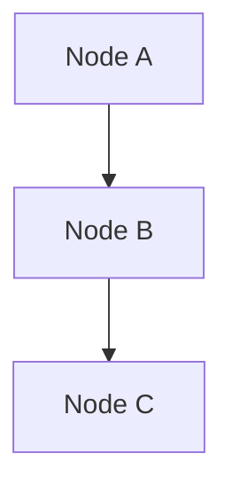

# 📊 Diagrammes Mermaid - Système FGP

Ce dossier contient tous les diagrammes Mermaid du système FGP (Fichier Général de la Population).

## 📁 Fichiers Disponibles

### 1. `architecture-system.mmd`
**Diagramme d'architecture générale du système**
- Vue d'ensemble des microservices
- Couches (Frontend, Gateway, Services, Data, Monitoring)
- Intégrations externes
- Flux de communication

### 2. `database-schema.mmd`
**Schéma de base de données complet**
- Table principale FGP_PERSON_CORE (27 variables)
- Tables d'extensions par strate (9 strates)
- Tables de support (biométrie, documents, audit, ABIS)
- Relations et contraintes

### 3. `data-flow.mmd`
**Flux de données et processus d'enrôlement**
- Processus complet d'enrôlement
- Déduplication biométrique (ABIS)
- Validation et sauvegarde
- Gestion des erreurs

### 4. `microservices-communication.mmd`
**Communication entre microservices**
- Séquence d'appels API
- Orchestration des services
- Gestion des transactions
- Cas d'erreur

### 5. `deployment-architecture.mmd`
**Architecture de déploiement en production**
- Clustering et haute disponibilité
- Load balancing
- Réplication de données
- Monitoring et sécurité

## 🖥️ Comment Visualiser les Diagrammes

### Option 1: Mermaid Live Editor (Recommandé)
1. Aller sur https://mermaid.live/
2. Copier le contenu d'un fichier `.mmd`
3. Coller dans l'éditeur
4. Le diagramme s'affiche automatiquement

### Option 2: VS Code avec Extension Mermaid
1. Installer l'extension "Mermaid Preview" dans VS Code
2. Ouvrir un fichier `.mmd`
3. Utiliser `Ctrl+Shift+P` → "Mermaid Preview"

### Option 3: GitHub/GitLab
- Les diagrammes Mermaid s'affichent automatiquement dans les fichiers `.md` sur GitHub/GitLab

### Option 4: Outils en ligne
- **Mermaid Chart**: https://www.mermaidchart.com/
- **Draw.io**: https://app.diagrams.net/ (import Mermaid)
- **Excalidraw**: https://excalidraw.com/

## 🛠️ Modification des Diagrammes

### Syntaxe Mermaid
Les diagrammes utilisent la syntaxe Mermaid standard :

### Types de Diagrammes Utilisés
- **graph TB**: Graphiques orientés (Top-Bottom)
- **erDiagram**: Diagrammes entité-relation
- **flowchart TD**: Flux de processus
- **sequenceDiagram**: Diagrammes de séquence

### Bonnes Pratiques
1. **Noms explicites**: Utiliser des noms clairs et descriptifs
2. **Couleurs cohérentes**: Maintenir la cohérence des couleurs par type de composant
3. **Légendes**: Ajouter des descriptions pour les éléments complexes
4. **Versioning**: Mettre à jour les diagrammes avec les modifications du système

## 🔄 Mise à Jour des Diagrammes

### Quand mettre à jour ?
- Modification de l'architecture
- Ajout/suppression de services
- Changement de schéma de base de données
- Modification des flux de données

### Comment mettre à jour ?
1. Modifier le fichier `.mmd` correspondant
2. Tester la visualisation
3. Mettre à jour la documentation associée
4. Commiter les changements

## 📋 Checklist de Validation

Avant de commiter un diagramme :
- [ ] Le diagramme s'affiche correctement
- [ ] Les relations sont cohérentes
- [ ] Les couleurs sont appropriées
- [ ] Les noms sont explicites
- [ ] La documentation est mise à jour

## 🎨 Convention de Couleurs

| Type de Composant | Couleur | Usage |
|-------------------|---------|-------|
| Frontend | Bleu clair (#e1f5fe) | Interfaces utilisateur |
| Gateway | Violet (#f3e5f5) | Points d'entrée API |
| Microservice | Vert (#e8f5e8) | Services backend |
| Base de données | Orange (#fff3e0) | Persistance des données |
| Cache | Jaune (#fff8e1) | Stockage temporaire |
| Monitoring | Rose (#fce4ec) | Observabilité |
| Sécurité | Rouge clair (#ffebee) | Composants de sécurité |
| Externe | Vert clair (#e0f2f1) | Systèmes tiers |

## 🔗 Liens Utiles

- [Documentation Mermaid](https://mermaid-js.github.io/mermaid/)
- [Mermaid Live Editor](https://mermaid.live/)
- [Syntaxe ER Diagram](https://mermaid-js.github.io/mermaid/#/entityRelationshipDiagram)
- [Syntaxe Sequence Diagram](https://mermaid-js.github.io/mermaid/#/sequenceDiagram)

